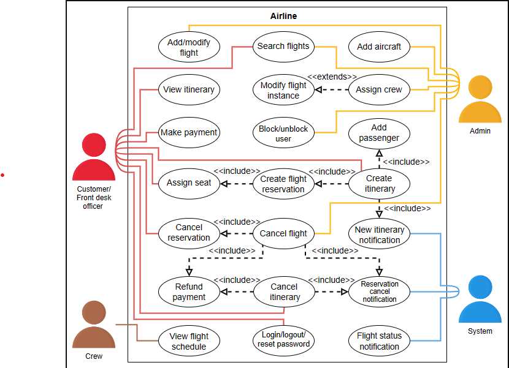
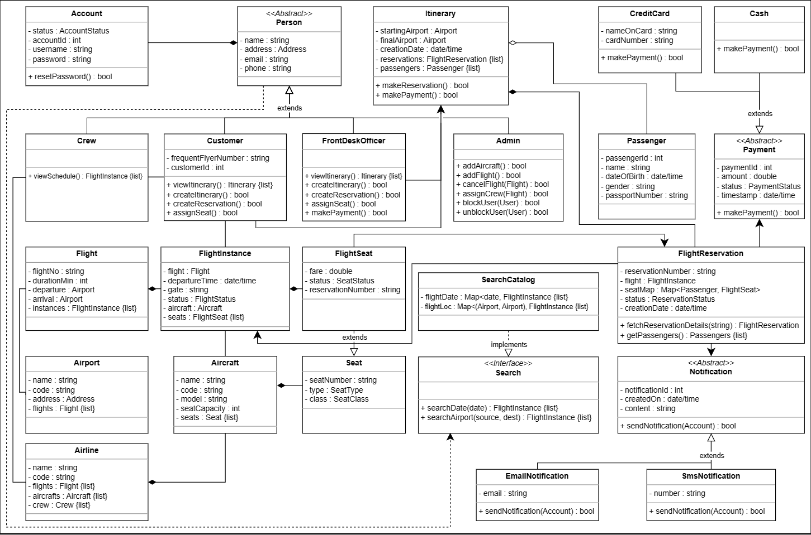
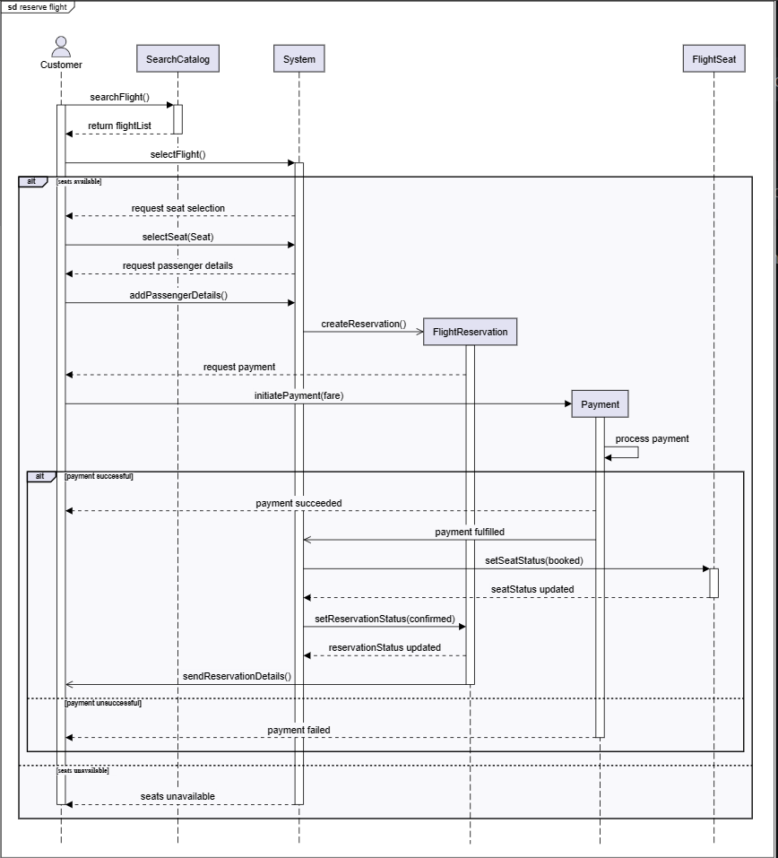
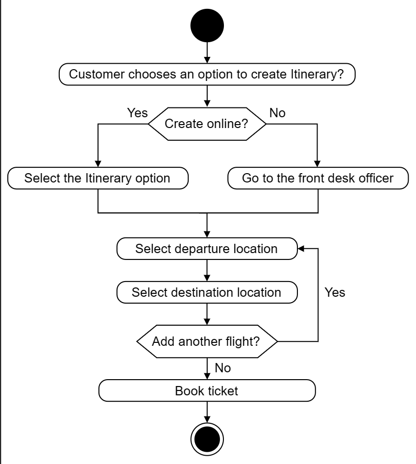

# Problem definition

An airline management system is a software used to manage all activities of the airline system efficiently. Nowadays, every airline has a management system to digitize the process of scheduling flights, managing staff, ticket reservations, and performing other necessary airline management tasks. Moreover, the system keeps track of the number of aircraft, pilots, and their availability at airports. The system provides customers the complete flight information so they can view the available flights and schedule them online. Similarly, the admin can manage all the airline activities with the help of this system. Therefore, the airline management system facilitates its customers as well as admins and controls all the operations of the airline company.

## Expectations from the interviewee

There are several components present in the airline management system, each with specific constraints and requirements. The following provides an overview of some of the main things that the interviewer will want to hear you discuss in more detail, during the interview.

## Flight reservation

Flight reservation is an essential part of the airline management system. The system has to ensure that no two people should be mapped to the same seat. The interviewer expects you to ask questions to identify how the system will complete flight reservations:

- How will the system ensure that multiple users do not have the same seat on the aircraft?

- Can one itinerary reserve multiple flights?

- Can the customer reserve the whole aircraft?

## Payment handling

One of the airline management system's most significant attributes is its payment structure for its customers. This can vary, so the interviewer would expect you to ask the questions listed below:

What payment methods can the customer use, for example, credit card or cash?

How does the customer make the payment? Does the customer pay online or in persone?

Will the customer be able to pay in advance for a flight booking, or is a just-in-time (JIT) payment method available?

## Price variance

Now that we’ve discussed the payment methods of the airline management system, let’s ask the interviewer about the pricing model. You may ask the questions listed below:

Is the price set manually, or does the system calculate the price for each flight?

Does every seat has the same price, or is it calculated based on the seat type?

Does the weekdays and weekends affect the price of the flight?

Is the price of the flight affected by an increase in demand?

How does the duration of the flight affect the payment?

## Flight cancellation

In the airline management system, the customer may want to cancel the flight after booking it. Therefore, you can ask the following questions:

Can the customer cancel a flight?

What is the time limit to cancel the flight?

Which type of users are allowed to request a flight cancellation?

## Design approach

We’ll design this airline management system using the bottom-up approach. For this purpose, we will follow the steps below:

Identify and design the smallest components first, including seat, flight, etc.

Use these small components to design bigger components, including airport, aircraft that can be composed of multiple seats, etc.

Repeat the steps above until we design the whole airline management system.

## Design pattern

It is always a good practice to discuss the design patterns that an airline management system falls under, during the interview. Stating the design patterns will give the interviewer a positive impression and shows that the interviewee is well-versed in the advanced concepts of object-oriented design.

The following design patterns can be used to design the airline management system:

The Singleton design pattern

The Observer design pattern

Let’s explore the requirements of the airline management system in the next lesson.

## Requirement

R1: A customer should be able to search for flights by the date, departure, and destination airport.

R2: A customer should be able to reserve tickets for available flights. Customers should also be able to book multiple flights at once.

R3: The customer should be allowed to book multiple seats for a single flight.

R4: The system should allow the customer to check flight details, such as available seats, flight schedules, and departure/arrival times.

R5: The admin should be able to add new flights. The admin should be able to update or cancel scheduled flights.

R6: An airline should be able to own multiple aircrafts. The admin should be able to add these aircrafts to the system.

R7: An airline should be able to operate its flights from different airports.

R8: The admin should be able to assign pilots and crew members to flights effectively.

R9: The customer should be able to make payments against their flight reservations.

R10: The customer should be able to cancel their previous reservations.

R11: The front desk officer should be able to reserve tickets, create itineraries, and make flight payments for the customer.

R12: The flight crew should be able to view the schedule for their assigned flights.

R13: The system should send the customer a notification whenever a reservation has been made or canceled or when there is an update for their flight.

## Use case Diagram

System
Our system is an "airline."

Actors
Now, we’ll define the main actors of the airline management system.

Primary actors 
Customer: The customer is the airline's primary actor who can search for flights, create an itinerary, make a payment, and update or cancel the flight reservation.

Front desk officer: This actor can perform all the actions that the customer can. The front desk officer can create an itinerary, make payment, update or cancel the flight reservation on behalf of customers, assign them seats, and search for flights.

Admin: The admin is in charge of performing numerous operations, like adding aircraft to the system, adding or modifying flights, flight instances, and their schedules, canceling any flight, and assigning crew to the flight.

Secondary actors
System: This actor is responsible for sending notifications for flight status updates, itinerary changes, and reservation cancellations.

Crew: This actor can view the schedules of the assigned flights.

Use cases
In this section, we’ll define the use cases for an airline management system. We have listed the use cases according to their respective interactions with a particular actor.

Note: You’ll see some use cases occurring multiple times because they are shared among different actors in the system.

Customer/front desk officer
Update/cancel reservation: To update or cancel a flight reservation of the customer

Login/logout: To log in or log out of the airline system

Reset password: To reset the password of the account

Create itinerary: To create an itinerary for the customer

Assign seat: To assign a seat to the passenger for the flight

Search flights: To search for flights in the airline management system

Make payment: To pay for the itinerary or flight reservation

View itinerary: To view the details of an itinerary

Cancel itinerary: To cancel the itinerary for the customer

Admin
Add aircraft: To add a new aircraft to the airline management system

Add/modify flight: To add a new flight or modify it

Assign crew: To assign crew to the flight instance

Block/unblock user: To block or unblock a user in an airline management system

Cancel flight: To cancel the instance of a flight

Search flights: To search for flights in the airline management system

System
New itinerary notification: To send a notification of a new itinerary to the customer

Flight status notification: To send the flight status update notification to the customer

Reservation cancel notification: To send a reservation cancellation notification to the customer

Crew
View flight schedule: To view the schedule of the assigned flights

Relationships
We describe the relationships between and among actors and their use cases in this section.

## Include
To create an itinerary, one or more flight reservations should be created to add the passengers to the itinerary. Therefore, the “Create itinerary” use case has an include relationship with both “Create flight reservation” and “Add passenger” use cases.

While creating a flight reservation, the seat should be assigned to the customer. Therefore, the “Create flight reservation” use case has an include relationship with the “Assign seat” use case.

Whenever the flight is canceled, its related flight reservations should also be canceled. Hence the “Cancel flight” use case has an include relationship with the “Cancel reservation” use case.

When an itinerary is created, a notification is sent to the customer. Therefore, the “Create itinerary” use case has an include relationship with the “New itinerary notification” use case.

If an itinerary is canceled, the payment will be refunded, and a reservation cancellation notification will be sent to the customer. Hence, the “Cancel itinerary” use case has an include relationship with both “Refund payment” and “Reservation cancellation notification” use cases.

When the flight is canceled, the payment will be refunded, and a reservation cancellation notification will be sent to the customer. Hence, the “Cancel reservation” use case has an include relationship with both “Refund payment” and “Reservation cancellation notification” use cases.

## Extend

When modifying the flight instance, the admin can assign the crew to the flight instance. Therefore, the “Modify flight instance” use case has an extend relationship with the “Assign crew” use case.



## Class Diagram

### Account

The Account class identifies the username and ID of an airline management system user. . The class definition is represented below:

### Person

Person is an abstract class used to store information related to a person like a name, email, phone number, etc. In this class, the Address object type specifies the person’s address. There can be four types of accounts in the system:

Admin: This class keeps track of the overall system and flight and aircraft records.

Crew: This class views assigned flights in the system.

FrontDeskOfficer: This class manages passenger reservations.

Customer: This class views flight schedule, and reserves or cancels flight reservations.

The relationship diagram for these classes is shown below:

### Airline, airport, and aircraft

The Airline class has attributes like a name and an airline code to distinguish the airline from other airlines. It is an essential part of the airline management system.

Each airline operates out of different airports. Therefore, we need the Airport class to keep track of all the airports in the system.

Airlines own or hire aircraft to carry out their flights. The Aircraft class has attributes like name, model, manufacturing year, etc.

Here’s a visual representation of these classes:

### Seat and flight seat

The Seat class represents a physical seat in the aircraft. It contains basic information like seat number, seat type, and class. The FlightSeat class is derived from the Seat class and represents the seat assigned to a specific flight instance. It contains the fare for that particular seat and its reference number.

The relationship diagram for these classes is shown below:

### Flight and flight instance

The Flight class contains information about a particular flight, including the flight number, departure and arrival airports, and the duration of the flight. The FlightInstance class represents a single occurrence of a flight, since a flight can fly multiple days in a week.

### Flight reservation

The FlightReservation class manages the reservations made by the customer against a flight instance. It has attributes like unique reservation number, passengers and their assigned seats, and the reservation status.

Itinerary and passenger
Customers create an itinerary for their travel that contains flight reservations. The Itinerary class keeps track of all the reservations made, the list of passengers, and the departure/arrival airport.

The Passenger class keeps a record of all individuals with the reservation. It also includes the basic travel information of the passenger.

Here’s the class diagram for these classes:

Search and catalog#
The Search interface allows the customers to search for any flight using the following criteria:

Departure and arrival date and time

Source and destination airports

The SearchCatalog implements the search functionality and contains a list of all flights of the airline. The two classes are shown below:

Payment
The Payment class will be an abstract class and will have two child classes: CreditCard, and Cash.

The visual representation of these classes is as follows:

### Notification

Notification is an abstract class, since it can send a notification via email or SMS. It is mainly responsible for sending notifications whenever required.

The UML representation of the class is shown below:

### Enumerations

The enumerations required in the airline management system design are listed below:

AccountStatus: The account status tells us about the status of a customer's account—whether it is active, deactivated, closed, or blocked.

SeatStatus: The seat status tells us whether the seat is available, booked, or a chance seat.

SeatType: The seat type tells us whether the seat is of a regular, accessible, emergency exit, or extra legroom type.

SeatClass: The seat class tells us whether the seat is economy, economy plus, business, or first class.

FlightStatus: The flight status keeps track of the flight instance—whether it is factive, scheduled, delayed, departed, landed, canceled, diverted, or unknown.

ReservationStatus: The reservation status tells us about the status of the reservation—whether it is requested, pending, confirmed, checked in, or canceled.

PaymentStatus: The payment status tells us about the status of the payment—whether it is pending, completed, canceled, failed, declined, or refunded.

Custom data type
We need to create a custom data type, Address, that will store the physical location of any place.



### Design pattern

The Airline class follows the Singleton design pattern because there will only be a single instance of the Airline class as it is the main organizational class.

The airline management system can also implement the Observer design pattern because all the passengers flying in a particular flight instance must be updated about any changes in their flight schedule. The passengers here will act as subscribers and be notified whenever the flight status changes.

We have successfully designed the class diagram for the airline management system. Let’s see how we can construct the sequence diagram for the system in our next lesson.

## Sequence diagram

### Reserve a flight

The sequence diagram for reserving a flight should have the following actors and objects that will interact with each other:

Actor: Customer

Objects: SearchCatalog, FlightReservation, FlightSeat, and Payment

System

Here’re the steps in the reserve flight interaction:

The customer searches for flights flying from an airport on a particular date.

The catalog returns a list of flights that satisfy the search query.

The customer selects a flight.

If seats are available:

The system requests the customer to select seats.

The customer selects a seat.

The system requests to add passenger details.

The customer adds passenger details.

The system creates a reservation for the customer.

Payment is requested against the reservation.

The customer initiates a transaction, and the payment is processed.

If the payment is successful:

The customer and system are informed that the payment is successful.

The system updates the seat status to booked.

The system updates the reservation status to confirmed.

The reservation details are sent to the customer.

Else, if the payment is unsuccessful:

The customer is informed that the payment has failed.

Else, if seats are unavailable:

The customer is informed that no seats are available.

Note: We assume that the customer performs a valid search that will result in a list of flights.

Based on the order above, the sequence diagram for reserving a flight in the airline management system is given below.



## Activity Diagram

Activity diagrams are a great way to visualize the flow of messages from one activity to the other in the system. There can be different activity diagrams that we can create for the airline management system. In this lesson, we will create activity diagrams for the following two activities:

Creating an itinerary

Activity challenge: The user receives a confirmation notification after making the payment.

Create an itinerary
The states and actions that will be involved in this activity diagram are provided below.

States
Initial state: The customer chooses an option to create the itinerary.

Final state: A customer books their ticket.

Actions
The customer selects an option to create an itinerary online themselves or through the front desk officer. The customer then selects their flights. Finally, the customer books their ticket.



## Code for Airline management

```

class Address {
  private int zipCode;
  private string streetAddress;
  private string city;
  private string state;
  private string country;
}

enum AccountStatus {
  ACTIVE,
  DISABLED,
  CLOSED,
  BLOCKED
}

enum SeatStatus {
  AVAILABLE,
  BOOKED,
  CHANCE
}

enum SeatType {
  REGULAR,
  ACCESSIBLE,
  EMERGENCY_EXIT,
  EXTRA_LEG_ROOM
}

enum SeatClass {
  ECONOMY,
  ECONOMY_PLUS,
  BUSINESS,
  FIRST_CLASS
}

enum FlightStatus {
  ACTIVE,
  SCHEDULED,
  DELAYED,
  LANDED,
  DEPARTED,
  CANCELED,
  DIVERTED,
  UNKNOWN
}

enum ReservationStatus {
  REQUESTED,
  PENDING,
  CONFIRMED,
  CHECKED_IN,
  CANCELED
}

enum PaymentStatus {
  PENDING,
  COMPLETED,
  FAILED,
  DECLINED,
  CANCELED,
  REFUNDED
}

public abstract class Person {
    private string name;
    private Address address;
    private string email;
    private string phone;
    private Account account;
}

class Admin : Person {
  public bool AddAircraft(Aircraft aircraft);
  public bool AddFlight(Flight flight);
  public bool CancelFlight(Flight flight);
  public bool AssignCrew(Flight flight);
  public bool BlockUser(User user);
  public bool UnblockUser(User user);
}

class Crew : Person {
  public List<FlightInstance> ViewSchedule();
}

class FrontDeskOfficer : Person {
  public List<Itinerary> ViewItinerary();
  public bool CreateItinerary();
  public bool CreateReservation();
  public bool AssignSeat();
  public bool MakePayment();
}

class Customer : Person {
  private int customerId;

  public List<Itinerary> ViewItinerary();
  public bool CreateItinerary();
  public bool CreateReservation();
  public bool AssignSeat();
  public bool MakePayment();
}

class Seat {
  private string seatNumber;
  private SeatType type;
  private SeatClass _class;
}

class FlightSeat : Seat {
  private double fare;
  private SeatStatus status;
  private string reservationNumber;
}

class Flight {
  private string flightNo;
  private int durationMin;
  private Airport departure;
  private Airport arrival;
  private List<FlightInstance> instances;
}

class FlightInstance {
  private Flight flight;
  private DateTime departureTime;
  private string gate;
  private FlightStatus status;
  private Aircraft aircraft;
  private List<FlightSeat> seats;
}

class Itinerary {
  private Airport startingAirport;
  private Airport finalAirport;
  private DateTime creationDate;
  private List<FlightReservation> reservations;
  private List<Passenger> passengers;

  public bool MakeReservation();
  public bool MakePayment();
}

class FlightReservation {
  private string reservationNumber;
  private FlightInstance flight;
  private Dictionary<Passenger, FlightSeat> seatMap;
  private ReservationStatus status;
  private DateTime creationDate;

  public static FlightReservation FetchReservationDetails(String reservationNumber);
  public List<Passenger> GetPassengers();
}

public abstract class Payment {
  private int paymentId;
  private double amount;
  private PaymentStatus status;
  private DateTime timestamp;
  
  public abstract bool MakePayment();
}

class Cash : Payment {
    public override bool MakePayment() {
        // functionality
    }
}

class CreditCard : Payment {
    private string nameOnCard;
    private string cardNumber;
    
    public override bool MakePayment() {
        // functionality
    }
}

// Notification is an abstract class
public abstract class Notification {
    private int notificationId;
    private DateTime createdOn;
    private string content;

    public abstract void SendNotification(Account account);
}

class SmsNotification : Notification {
    public override void SendNotification(Account account) {
        // functionality 
    }
}

class EmailNotification : Notification {
    public override void SendNotification(Account account) {
        // functionality 
    }
}

interface Search {
  public List<FlightInstance> SearchFlight(Airport source, Airport dest, DateTime arrival, DateTime departure);
}

class SearchCatalog : Search {
  private Dictionary<(Airport, Airport, DateTime, DateTime), List<FlightInstance>> flights;

  public List<FlightInstance> SearchFlight(Airport source, Airport dest, DateTime arrival, DateTime departure) {
    // functionality
  }
}

class Airport {
  private string name;
  private string code;
  private Address address;
  private List<Flight> flights;
}

class Aircraft {
  private string name;
  private string code;
  private string model;
  private int seatCapacity;
  private List<Seat> seats;
}

class Airline {
  private string name;
  private string code;
  private List<Flight> flights;
  private List<Aircraft> aircrafts;
  private List<Crew> crew;
  
  // The Airline is a singleton class that ensures it will have only one active instance at a time
  private static Airline airline = null;

  // Created a static method to access the singleton instance of Airline
  public static Airline GetInstance {
    get {
      if (airline == null) {
        airline = new Airline();
      }
      return airline;
    }
  }
}

```
