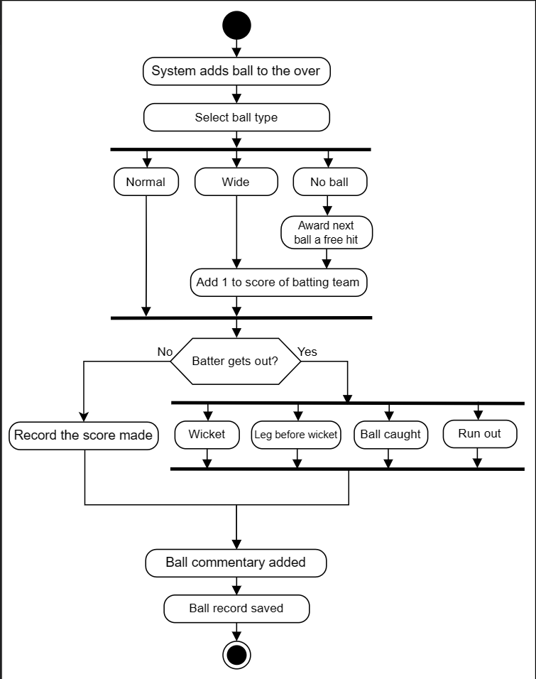

# Problem definition

Cricinfo also known as ESPNcricinfo, is one of the leading cricket-related websites in the world. The platform provides a live coverage of cricket matches, along with ball-by-ball commentary. This website has a database including historical matches from the 18th century till the present. This website provides cricket content globally and is followed by millions around the world. Users can find match updates, live cricket scores, match results on this website. This website also provides articles and news about cricket. Moreover, people can search for matches, teams, players, tournaments, etc. In short, this is a website for cricket lovers.

**Expectations from the interviewee**
Cricinfo provides multiple functionalities to its users. It is essential to narrow down what components you will include in your Cricinfo design. The section below provides an overview of some of the main expectations that the interviewer will want to hear you discuss in more detail, during the interview.

**Live matches**
Coverage of a live match is one of the most important features of a cricket website. The user must be able to see the live matches on the platform. To get a better understanding of live matches, you can ask interviewer questions like this:

How is information of the match updated?

What is the process for adding commentary?

At what intervals is the commentary added?

**Statistics**
It is crucial to store the statistics of the matches in the Cricinfo system. Therefore, you can ask the following questions:

What kind of stats does the system record?

Does the system record the statistics of players and teams?

**People**
There are different people involved in cricket matches. Therefore, to get an idea of the type of people in the system, you can ask the following questions:

What kind of people does our system need to store the information about, for example, players, coaches, etc?

Will the umpire data be stored in the system?

Who will input data into the Cricinfo system? What are the actors of the Cricinfo system?

**Tournament**
A tournament is a series of matches played between a number of teams. Therefore, the interviewer would expect you to ask the following questions:

How does the system keep track of different tournaments?

How are the tournament points and rankings stored in the system?

## Design approach

We’ll design Cricinfo using the bottom-up approach. For this purpose, we will follow the steps below:

Identify and design the smallest components first, like a ball and run.

Use these small components to design bigger components, for example, an over, team, and an umpire.

Repeat the steps above until we design the complete Cricinfo platform.

## Design pattern

It is always a good practice to discuss the design patterns that a Cricinfo system falls under during the interview. Stating the design patterns will give the interviewer a positive impression and shows that the interviewee is well-versed in the advanced concepts of object-oriented design. We can use the Factory design pattern to design Cricinfo.

Let’s explore the requirements for Cricinfo in the next lesson.

## Requirements

R1: The system should be able to track the stats of all players, teams, and matches.

R2: The system should be able to track all scores or wickets that occurred for each ball. The system should also provide a live commentary for every ball.

R3: The system should be able to keep track of all matches—Test, T20, and ODI matches.

R4: The system should be able to keep track of ongoing and previous tournaments. The system should also be able to show a points table for all teams participating in a tournament.

R5: The system should be able to show the result of all previous televised matches.

R6: All teams should select some players who will participate in the tournament known as the tournament squad.

R7: For every match, the teams should be able to select 11 players to play on the field from the tournament squad, known as the playing eleven.

R8: The admin of the system should be able to add tournaments, matches, teams, players, and news to the system.

## Use case diagram for cricinfo

System
Our system is "Cricinfo."

Actors
Now, we’ll define the main actors of Cricinfo.

Primary actors 
Admin: The admin is in charge of performing numerous operations—adding or modifying tournaments, innings, updating stats, etc.

Commentator: This actor can add commentary to the match or modify it.

Secondary actors
There is no secondary actor in the system.

Use cases
In this section, we’ll define the use cases for Cricinfo. We have listed the use cases according to their respective interactions with a particular actor.
Admin
Add/modify team: To add a team in the system or modify it

Add/modify player: To add a player to the team or modify it

Add/modify tournament: To add a tournament in the system or modify it

Add/modify team squad: To add a team squad or modify it

Add/modify innings: To add innings in the match or modify it

Add/modify over: To add an over in the match or modify it

Add/modify ball: To add a ball in the match or modify it

Add match: To add a match in the system

Add/update news: To add the match news in the system or update it

Add/modify stadium: To add a stadium in the system or modify it

Add/modify umpire: To add an umpire in the system or modify it

Add/update stats: To add stats of a player, match, or tournament to the system

Commentator
Add/modify commentary: To add a commentary to the match or modify it

Relationships
We describe the relationships between and among actors and their use cases in this section.

Generalization
The admin can add/update stats by adding/updating player, match, or tournament stats. This shows “Add/update stats” use case has a generalization relationship with the “Add/update player stats,” “Add/update match stats,” and “Add/update tournament stats” use cases.

The admin can add the match type—T20, test, or ODI. Hence, the “Add match” use case has a generalization relationship with the “Add T20,” “Add test,” and “Add ODI” use cases.

Associations
The table below shows the association relationship between actors and their use cases.

Extend
While adding/modifying the ball, either a run, wicket, or both are added/modified. Therefore, the “Add/modify ball” use case has an extend relationship with the “Add/modify run” and “Add/modify wicket” use cases.

Use case diagram
Here’s the use case diagram of Cricinfo:


## Class Diagram

Components of Cricinfo
As mentioned earlier, we will design the Cricinfo system using a bottom-up approach.

Admin
The Admin class is responsible for managing the system as well as adding and modifying updates. The representation of the class is shown below:

Run, ball, and wicket
The Run class records the number and type of runs scored on a ball. The Ball class records every detail of a ball, such as the number of runs scored, if it was a wicket-taking ball, etc. The Wicket class records the details of the wicket, including its type, the player that bowled, and the player that was declared out.

The mentioned classes are shown below:

Over and innings
The Over class represents all the details of an over of the innings. The Innings class represents the details of a match innings. The two classes are shown below:

Match
The Match class is an abstract class that has three child classes that represent the types of matches that can take place.

The Test class

The ODI class

The T20 class

The class diagram is shown below:

Stadium
The Stadium class represents the information about a stadium, including its name, address, and capacity. The UML representation of this class is given below:

Player, coach, and umpire
The Player class includes the information of a player and their statistics. The Coach class contains the information of a coach. The Umpire class contains the information of an umpire. The three classes are shown below:

Team, tournament squad, and playing eleven
The Team class represents the information about a cricket team, including the list of players, the team coach, and any news related to the team.

The TournamentSquad class represents the team members participating in a tournament. The Playing11 class represents the squad members playing in a match.

The class diagram for these classes is given below:

Tournament and points table
The Tournament class contains information about a cricket tournament. The PointsTable class shows the accumulated points and match results of the teams that play in the tournament. These classes are shown below:

Stats
The Stat class is an abstract class that extends to PlayerStat, TeamStat, and MatchStat classes. These classes contain important statistics. The UML representation is shown below:

Commentator and commentary
The Commentator class records the information about the commentator. The Commentary class contains information about the commentary for every ball of an over. The two classes are shown below:

News
The News class holds the news updates of a team. The definition of this class is given below:

Enumerations
The enumerations required in the Cricinfo system are listed below:

MatchResult: This records the result of a match— a win, loss, canceled, or drawn.

UmpireType: This records the type of umpire—field umpire, third umpire, or reserved.

WicketType: This records the type of the wicket—stumped, bold, caught, etc.

BallType: This records the type of ball played—a regular delivery, wide, no ball, or wicket.

RunType: This records the type of run scored—a regular run, four, six, wide, etc.

PlayingPosition: This records the playing position of a player—batsman, bowler, and all-rounder.

Custom data type
We need to create a custom data type, Address, that will store the physical location of any place.

Relationship between classes
Now, we will discuss the relationships between the classes we have defined above in our Cricinfo system.

Association
The class diagram has the following association relationships:

One-way association
The Admin class has a one-way association with the Player, Team, Match, and Tournament classes.

The Player class has a one-way association with the Run, Ball, Wicket, and Over classes.

The Team class has a one-way association with the TournamentSquad and Tournament classes.

The TournamentSquad class has a one-way association with the Playing11 class.

Two-way association
The Ball class is associated with the Run, Wicket, and Commentary classes.

The Team class is associated with the Coach and News classes.

The Commentary class is associated with the Commentator class.

The Match class is associated with the Umpire, Commentator, and Stadium classes.


Aggregation
The class diagram has the following aggregation relationships:

The Tournament class contains the TournamentSquad class.

Composition
The class diagram has the following composition relationships:

The Player class is composed of the PlayerStat class.

The Team class is composed of the Player and TeamStat classes.

The Tournament class is composed of the Match and PointsTable classes.

The Match class is composed of the Playing11, Innings, and MatchStat classes.

The Innings class is composed of the Over class.

The Over class is composed of the Ball class.

Inheritance
The class diagram has the following inheritance relationships:

The ODI, Test, and T20 classes are derived from the Match class.

The TeamStat, MatchStat, and PlayerStat classes are derived from the Stat class.

Class diagram of Cricinfo
Here’s the complete class diagram for Cricinfo:


## Sequence Diagram

Add a match
The sequence diagram for adding a match should have the following actors and objects that will interact with each other:

Actors: Admin, Umpire, and Commentator

Objects: Match and Stadium

The steps involved in adding a match are listed below:

The admin creates a new match of a specific match type.

The admin adds the playing teams for the match.

The admin assigns a stadium to the match.

The admin assigns an umpire to the match.

The admin assigns a commentator to the match.

Based on the order above, the sequence diagram for adding a match in the Cricinfo system is provided below:


## Activity Diagram

Make a record of a ball
The states and actions that will be involved in this activity diagram are provided below.

States
Initial state: The system adds a ball to the over.

Final state: The ball record is saved.

Actions
The system adds a ball to the over. The system chooses the ball type that was bowled. The system determines if the batter got out. If they did not, it adds the score that was made. Finally, the commentary is added to the ball, and the ball record is saved.



## Code for Cricinfo

In this section, we will provide the skeleton code of the classes designed in the class diagram lesson.

Note: For simplicity, we are not defining getter and setter functions. The reader can assume that all class attributes are private and accessed through their respective public getter methods and modified only through their public method functions.

Constants
The following code defines the various enums and custom data types used in the Cricinfo design:

Note: JavaScript does not support enumerations. We’ll usethe Object.freeze() method as an alternative. It freezes an object and prevents further modifications.

```
class Address {
  private int zipCode;
  private string streetAddress;
  private string city;
  private string state;
  private string country;
}

enum MatchResult {
  LIVE,
  BAT_FIRST_WIN,
  FIELD_FIRST_WIN,
  DRAW,
  CANCELED
}

enum UmpireType {
  FIELD,
  RESERVED,
  THIRD_UMPIRE
}

enum WicketType {
  BOLD,
  CAUGHT,
  STUMPED,
  RUN_OUT,
  LBW,
  RETIRED_HURT,
  HIT_WICKET,
  OBSTRUCTING,
  HANDLING
}

enum BallType {
  NORMAL,
  WIDE,
  NO_BALL,
  WICKET
}

enum RunType {
  NORMAL,
  FOUR,
  SIX,
  LEG_BYE,
  BYE,
  NO_BALL,
  OVERTHROW
}

enum PlayingPosition {
  BATTING, 
  BOULING,
  ALL_ROUNDER
}

class Admin {
  public bool addPlayer(Player player);
  public bool AddTeam(Team team);
  public bool AddMatch(Match match);
  public bool AddTournament(Tournament tournament);
  public bool AddStats(Stat stats);
  public bool AddNews(News news);
}
class Player {
  private string name;
  private int age;
  private int country;
  private PlayerPosition position;
  private List<Team> teams;
  private PlayerStat stat;
}

class Coach {
  private string name;
  private int age;
  private int country;
  private List<Team> teams;
}

class Umpire {
  private string name;
  private int age;
  private int country;

  public bool AssignMatch(Match match);
}

class Run {
  private int totalRuns;
  private RunType type;
  private Player scoredBy;
}

class Ball {
  private Player balledBy;
  private Player playedBy;
  private BallType type;
  private List<Run> runs;
  private Wicket wicket;

  public bool AddCommentary(Commentary commentary);
}

class Wicket {
  private WicketType type;
  private Player playerOut;
  private Player balledBy;
  private Player caughtBy;
  private Player runoutBy;
  private Player stumpedBy;
}

class Over {
  private int number;
  private Player bowler;
  private int totalScore;
  private List<Ball> balls;

  public bool AddBall(Ball ball);
}

class Innings {
  private Playing11 bowling;
  private Playing11 batting;
  private DateTime startTime;
  private DateTime endTime;
  private int totalScores;
  private int totalWickets;
  private List<Over> overs;

  public bool AddOver(Over over);
}

public abstract class Match {
  private DateTime startTime;
  private MatchResult result;
  private int totalOvers;
  private List<Playing11> teams;
  private List<Innings> innings;
  private Playing11 tossWin;
  private Dictionary<Umpire, UmpireType> umpires;
  private Stadium stadium;
  private List<Commentator> commentators;
  private List<MatchStat> stats;

  public abstract bool AssignStadium(Stadium stadium);
  public abstract bool AssignUmpire(Umpire umpire);
}

public class T20 : Match {
  public override bool AssignStadium(Stadium stadium);
  public override bool AssignUmpire(Umpire umpire);
}

public class Test : Match {
  public override bool AssignStadium(Stadium stadium);
  public override bool AssignUmpire(Umpire umpire);
}

public class ODI : Match {
  public override bool AssignStadium(Stadium stadium);
  public override bool AssignUmpire(Umpire umpire);
}

class Team {
  private string name;
  private List<Player> players;
  private Coach coach;
  private List<News> news;
  private TeamStat stats;

  public bool AddSquad(TournamentSquad squad);
  public bool AddPlayer(Player player);
  public bool AddNews(News news);
}

class TournamentSquad {
  private List<Player> players;
  private Tournament tournament;
  private List<TournamentStat> stats;

  public bool AddPlayer(Player player);
}

class Playing11 {
  private List<Player> players;

  public bool AddPlayer(Player player);
}

class Tournament {
  private DateTime startDate;
  private List<TournamentSquad> teams;
  private List<Match> matches;
  private PointsTable points;

  public bool AddTeam(TournamentSquad team);
  public bool AddMatch(Match match);
}

class PointsTable {
  private Dictionary<string, float> teamPoints;
  private Dictionary<Team, MatchResult> matchResults;
  private Tournament tournament;
  private DateTime lastUpdated;
}

class Stadium {
  private string name;
  private Address location;
  private int maxCapacity;
}


class Commentator {
  private string name;

  public bool AssignMatch(Match match);
}

class Commentary {
  private string text;
  private DateTime createdAt;
  private Commentator commentator;
}

class News {
  private DateTime date;
  private string text;
  private List<byte> image;
  private Team team;
}

public abstract class Stat {
  public abstract bool UpdateStats();
}

class PlayerStat : Stat {
  private int ranking;
  private int bestScore;
  private int bestWicketCount;
  private int totalMatchesPlayed;
  private int total100s;
  private int totalHattricks;

  public override bool UpdateStats();
}

class MatchStat : Stat {
  private double winPercentage;
  private Player topBatsman;
  private Player topBowler;

  public override bool UpdateStats();
}

class TeamStat : Stat {
  private int totalSixes;
  private int totalFours;
  private int totalReviews; 

  public override bool UpdateStats();
}

```
